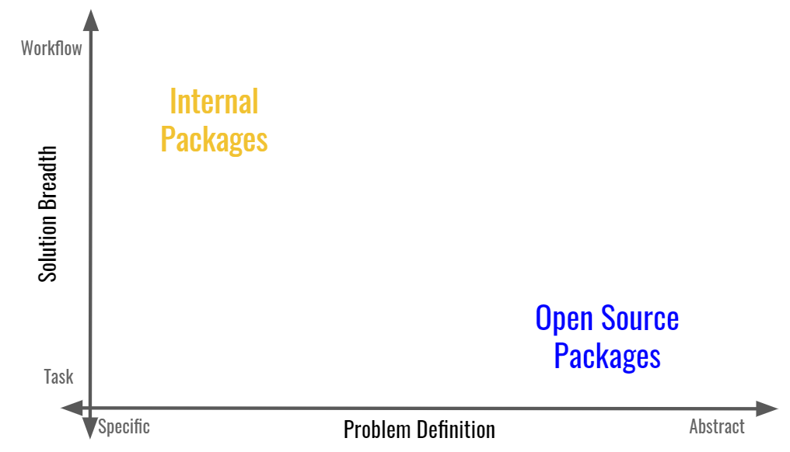
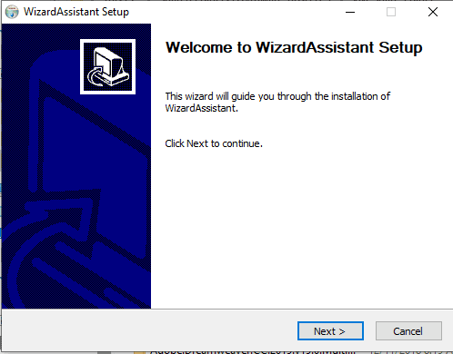

```{r setup, include=FALSE}
options(htmltools.dir.version = FALSE)
knitr::opts_chunk$set(fig.retina = 3, warning = FALSE, message = FALSE, fig.height = 6, fig.width = 15, echo = FALSE)
xaringanExtra::use_tachyons()
```

```{r metathis, echo=FALSE}
# https://www.garrickadenbuie.com/blog/sharing-xaringan-slides/
library(metathis)
meta() %>%
  meta_name("github-repo" = "llrs/nhsr2021") %>% 
  meta_social(
    title = "Improving (analysis) process: developing packages",
    description = paste(
      "Invited talk about creating packages to help with reproducibility and research",
      "For NHS-R community"
    ),
    url = "https://nhsr2021.llrs.dev",
    image = "https://nhsr2021.llrs.dev/images/first_slide.png",
    image_alt = paste(
      "Image of the first slide for Improving (analysis) process: developing packages", 
      ".", 
      "Presented for the NHS-R community on 2021/11/09 by Lluís Revilla Sancho"
    ),
    og_type = "website",
    og_author = "Lluís Revilla Sancho",
    twitter_card_type = "summary_large_image",
    twitter_creator = "@Lluis_Revilla"
  )
```

# About me

Bioinformatician at [CIBEREHD](https://www.ciberehd.org/en "CIBERHD's website") finishing my PhD at [IDIBAPS](https://www.clinicbarcelona.org/en/idibaps "IDIBAPS' website") a research center of the [Hospital Clinic de Barcelona](https://www.clinicbarcelona.org/en/ "Hospital's website").

.pull-left[

```{r out.alt="Photo of the main entrance of the hospital.", fig.cap="Source: Hospital Clínic de Barcelona", out.width="100%"}
knitr::include_graphics(path = "images/hospital_clinic.jpg", dpi = 1)
```

]

.pull-right[

Using mostly R for research with multiple packages and developing and maintaining other packages, from implementing mathematical theories ([BaseSet](https://cran.r-project.org/package=BaseSet "Package for fuzzy set operations")), help designing experiments ([experDesign](https://cran.r-project.org/package=experDesign "Package to analyse samples in batches")), comparing annotations of genes ([BioCor](https://bioconductor.org/packages/BioCor "Comparing genes and pathways annotations")).

And other packages unrelated to research: analysing R bugs ([bugRzilla](https://github.com/llrs/bugRzilla "Package still in development")) or the official state gazette of Spain ([BOE](https://ropenspain.github.io/BOE/ "BOE in Spanish acronym"))... 

]

???

You can also find me on [Twitter](https:/twitter.com/Lluis_Revilla) and on [my website](https://llrs.dev).

---

# Index

.pull-left[

.center[

A bit of background 


Practical recommendations


A step back to see the bigger picture
]
]

.pull-right[


]

---

# Improving processes: not repeating ourselves

Much of the progress of humanity has come from simplifying:


- Machines: Repeat actions  

- Templates: Repeat information  

- Software: Repeat logic  


???

Our efforts are to reduce repetition by humans or making those faster, easier and more efficient.

[TODO: Find image for each topic and add title above them]

---

# Science


.bg-washed-green.b--dark-green.ba.bw1.center[
Is a systematic enterprise that builds and organizes knowledge in the form of testable explanations and predictions
.tr[
— [Wikipedia](https://en.wikipedia.org/wiki/Science)
]]


???

Science is a method of knowledge: there are others like mathematics, philosophy, theology, ...

--


.center[  [The Turing Way](https://the-turing-way.netlify.app/reproducible-research/overview/overview-definitions.html "CC-BY The Turing Way" ) ]


 

???
Missing part: code/logic which needs to be the same (Same version, OS, ...)

---

# Code

.pull-left[
- Shareable
- Easier to understand (sometimes)
- Modularizable
- Repeatable (in principle)
]

.pull-right[

Recommendations:

- [Follow best practices](https://swcarpentry.github.io/r-novice-inflammation/06-best-practices-R/ "Software carpentery recommendation for scripts"): Decide a style, record dependencies, comment code...
- Find help: at your institution, from [NHS-R community](https://nhsrcommunity.com/r-near-me/ "NHS-R user groups") from organizations like [Research Software Engineer](https://society-rse.org/ "Community for research software engineer") or other organizations.
]


???

Better code benefits the process and the result. 

If reports are your main outcome they can also be automated via knitr parametrized reports or use interactive reports (See Simon Wellesley-miller talk tomorrow)


---

# Brief introduction to packages

Slide adapted from a [workshop](https://ghana.llrs.dev/#4) on how to develop packages.

.left-column[

```{r, echo=FALSE, out.width="100%", fig.alt="Tree view of the dtplyr package repository on 2021/08/06."}
knitr::include_graphics("images/tidyverse_dtplyr.png")
```

]

.right-column[

- `.github` folder: Files specific to GitHub (this is not necessary)
- A `R` folder with *.R files: your code.
- A `man` folder with *.rd files: your documentation.
- A `tests` folder: Check the code of the package.
- A `vignette` folder: Long documentation; not just examples.
- A `.Rbuildignore`: A file describing what to omit when building the package.
- A `DESCRIPTION` file: Summary and description of the package.
- A `LICENSE` file: The conditions under the package is released.
- A `NAMESPACE` file: What this package shares and needs.
- A `NEWS` file: What has changed since last release.
- A `README`: How to install and why this packages is needed and some basic examples.

]

???

I recommend to look at it, but here are some resources:

- [R extensions](https://cran.r-project.org/doc/manuals/r-release/R-exts.html "Offical complete instructions"): Official documentation, everything is answered here
- [R packages](https://r-pkgs.org/ "R pakages"): A book more digestible and using other packages and tools to create packages.


---

# From scripts to packages

.center[
 [Emily Riederer](https://emilyriederer.netlify.app/post/team-of-packages/ "Link to post about how to create internal packages")
]

???

Use function (use other's packages)

Write functions

Analysing some data might lead to a package or not (too specific, private logic).  

Package should provide some non-trivial solution to other's.
It might not be worth of publication (on traditional journals) but it might be worth sharing (on Journal of Open Source or just as a package people can install). 

Check [Emily Rieder's post](https://emilyriederer.netlify.app/post/team-of-packages/) on internal packages


---

# When to write a package?

After a search of a package that does solves your problem:

.pull-left[**Around a central idea**

A method, a program, a project, a report (like REDCapR)]

.pull-right[**A worflow/salad of processes**

Things you repeat (checking column names, match between two tables), steps you can automatize between manual/visual inspection.]

--

.indent[ ]

.center[

| Project | Use | Example |
|:---:|:---:|:---:|
|**Small** | script with functions | `function(x){x+5}` |
|**Medium** | script with package | [script](https://github.com/llrs/TRIM "Code for a project") + [own_package](https://github.com/llrs/integration "Internal package for integration") |
|**Large** | architecture/workflow |  [targets](https://cran.r-project.org/package=targets "Keeping track of the results") + [renv](https://rstudio.github.io/renv/index.html "Keeping track of packages and enviroment used") + script + own_package |

]

???

Depending on your work if it is more research based probably package around an idea or a salad to make your life easier
Because code in research most of them is run just once and few multiple times

If it is more clinical perhaps you do more reporting, and you might be interested on a mix to retrieve data and explore it with reports, plots... 

---

# Benefits for healthcare analytics

- More confidence on results and process

- Errors might be caught in advance (& fixed in advance)

- Automated repetitive process

> We’ve been using R with REDCap’s API since 2012 and have developed REDCapR. Before encapsulating these functions in a package, we were replicating 50+ lines of code to contact REDCap and robustly transform the returned csv into an R `data.frame`; it took twice that much to implement batching. All this can be done in one call to `redcap_read()`
>
> .right[[REDCapR's](https://cran.r-project.org/package=REDCapR) README]

- Reduce effort (long term)

> For ease of sharing, documenting, and testing we wrapped these tools up into an R package. 
> 
> .right[ [Jay Hugues](https://medium.com/healthfdn-data-analytics/introducing-a-new-r-package-to-process-primary-care-data-88e863130ada#236b "Blog post on how a package was developed")]

???

We built a package (in perl) to automate a process on our lab:
GETS: multiple analysis of RNA-seq data -> webpage/program

Documentation of process or why things are done that way

Advantages

 - Function checking
 - Documentation

Disadvantages

 - More experience programming (not that much)


Setting checks on scores (endoscopic scores, )
To mitigate the disadvantage it is better paired with other tools like [renv](https://rstudio.github.io/renv/index.html).

---

# How and when to use external packages

There are three ways: Depends, Imports, Suggests and Enhance

**Depending** is equivalent of `library("package")`: If the package is not present it does not install. Enhancing is equivalent of Depends.

**Import** is equivalent to `package::function()`: Only use some functions of the package.

**Suggests** means that it is not needed for the whole package but just some parts.

.details[

Suggests requires more work before hand but makes it easier to install your package.

You need to use:

```{r, eval=FALSE, echo=TRUE}
if (!requireNamespace("package", quiet = TRUE)) {
  stop("We need this package")
}
package::function()
```

]

???

If you use RNA-seq, 16S data design experiments: [Bioconductor](https://bioconductor.org)

[rOpenSci](https://ropensci.org) organization has also scientific tools: [targets](https://cran.r-project.org/package=targets) help avoiding rerunning the same steps.

If you are already considering building your own package you will already be aware of other packages.

---

# How to develop internal pacakges

If it is just you or few of you: your own computer and then share collaboratively via your version control system.

???

Depending on the support of your IT department or your setup/computer facilities.
Problems when editing the same file, I recommend using version control systems. 

--

If it is shared or you are trying to know if some more people might be interested, maybe on github or gitlab.

Example: [aurumpipeline](https://github.com/HFAnalyticsLab/aurumpipeline "Package to clean and process patient-level CPRD Aurum" )

???

Having this public or semi-public will make it easier a workmate or someone from the department besides you.
It will make it easier to collaborate in case you release your package to the public.


Internal packages are usually not shared outside the organization.

[medicaldata](https://higgi13425.github.io/medicaldata/index.html "Package with datasets for teaching") is another example but this is intended to be used by more people and as such is on CRAN. 

--

Very specific to institution, team, collaborators... which translate in a bit of work on finding what works best for you.

.center[


]
???

Take into consideration both the infrastructure you have, who develops and *maintains* the software and who benefits from it. 

Most research software is run few times and not worth keeping it along.

---

# How to use internal packages

Install from source each time (via `R CMD INSTALL` or `devtools::install`)

If you have your own Github organization you can use r-universe to gather the packages and make it easier to install them.

You could set up your own internal [CRAN-like repository](https://rstudio.github.io/packrat/custom-repos.html "Instructions for package repositoris").

Once installed use it normally as any other package on your reproducible environment.

.center[

 [WizardAssistant](https://wizardassistant.com/)

]

???

The main difference between internal and external packages is how are they installed (
There is a list of [potential soluctions](https://support.rstudio.com/hc/en-us/articles/115000239587-Sharing-Internal-R-Packages).
Depending on your institutions you might already have a local CRAN or [miniCRAN](https://cran.r-project.org/package=miniCRAN) so it might be easy to add your internal packages to that repository.

This also helps to know if the work is reproducible and if the package works well for the users (and not just you)

---

# Packages and process are not static

- R is not always equal, you might need to modify the package  
- Your users (or you) will not have always the same priorities
- Might need to move some functions to another package
- Use/set deprecation policies

.center[
```{r fig.alt="Image of the lava flow from palma, showing it exiting the cone, flowing and reaching the sea.", fig.cap="Source: El País", out.width="50%"}
knitr::include_graphics(path = "images/La_palma_volcano_flow.jpg")
```
]

???

At the beginning lots of activities and changes (eruption)

On the middle less changes but they might take new paths (redefining functions or finding better ways to do the same thing)

At the end the package development goes quiet but there is friction with changes on R and or other packages. 

---


# Going back to the big picture

Packages help trusting in the reporting and implementation:


.right[ [Gabriel Becker, Copyright Genentech Inc. ](https://gmbecker.github.io/MayInstituteKeynote2019/outline.html "Link to the slides with the original source") ]


???

[rOpenSci guide](http://ropensci.github.io/reproducibility-guide)
[Gabe Becker's slides about reproducibility](https://gmbecker.github.io/MayInstituteKeynote2019/outline.html)

---


# Conclusions

Not complicated to have packages.

Complicated to be consistent (new people, process change, people leave...)

Packages are just a part that help with being reproducible and replicable, there are others. 

.pull-left[

]

.pull-right[

Thank you!

[nhsr2021.llrs.dev](https://nhsr2021.llrs.dev)


[`r icons::fontawesome("linkedin")`](https://www.linkedin.com/in/lluisrevilla/) [`r icons::fontawesome("twitter")` Lluís Revilla](https://twitter.com/Lluis_Revilla/) 

[`r icons::fontawesome("github")` llrs](https://github.com/llrs/)


[`r icons::fontawesome("envelope-open-text")` lluis.revilla@ciberehd.org](lluis.revilla@ciberehd.org)


]
  
???

